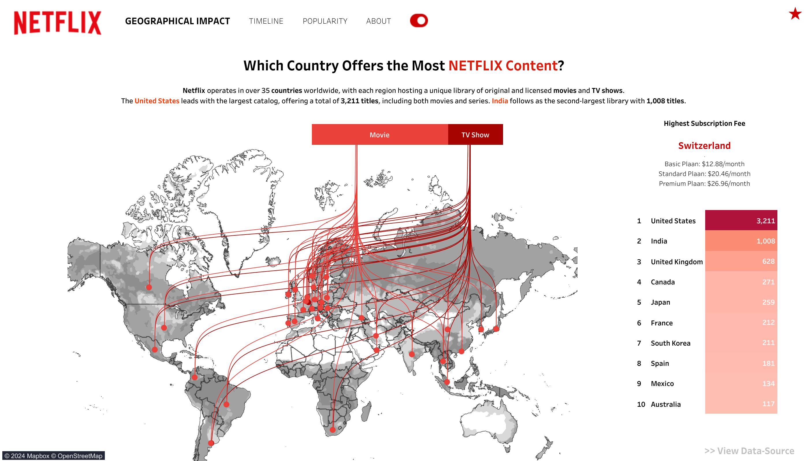
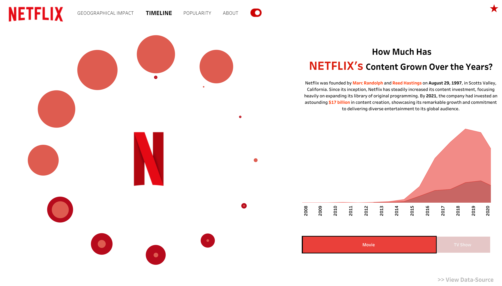
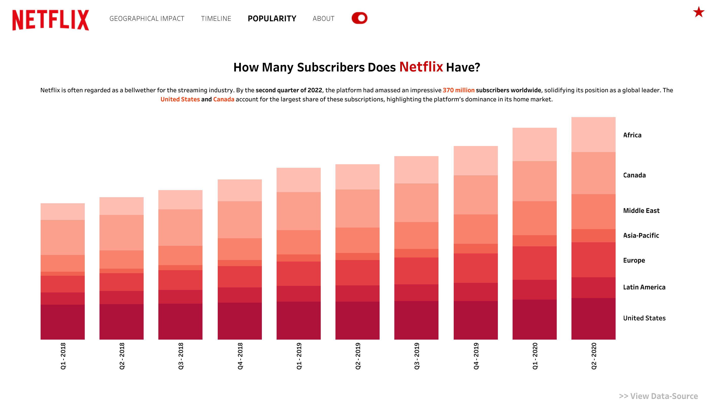

# 🎥 Netflix Data Visualization Project

Welcome to the **Netflix Data Visualization Project**, where we explore Netflix's global impact, content growth, and subscriber trends using data analytics and interactive dashboards. This project leverages datasets from Kaggle and tools like Python and Tableau to reveal insights into Netflix's strategy and evolution.

---

## 📖 Overview

Netflix has transformed the entertainment industry with its vast library of movies and TV shows. This project aims to answer three key questions:

1. **Geographic Impact**: Which countries offer the most Netflix content, and how does subscription pricing vary globally?
2. **Content Growth Timeline**: How has Netflix’s content library grown over the years?
3. **Popularity Metrics**: How many subscribers does Netflix have, and how are they distributed across regions?

Through data cleaning, analysis, and visualization, this project uncovers insights into Netflix's global strategy.

---

## 📂 Repository Structure

```bash
├── data/                           # Raw and cleaned datasets
│   ├── raw/                        # Original datasets from Kaggle
│   ├── processed/                  # Processed datasets for visualization
├── notebooks/                      # Jupyter Notebooks for analysis
│   ├── data_cleaning.ipynb         # Data cleaning and preprocessing
│   └── analysis.ipynb              # Exploratory data analysis
├── visualizations/                 # Tableau dashboards and static images
│   ├── Geographical.jpeg           # Geographical impact dashboard image
│   ├── Timeline.jpeg               # Content growth timeline dashboard image
│   └── Popularity.jpeg             # Subscriber metrics dashboard image
├── README.md                       # Project documentation
└── LICENSE                         # License for the repository
```
---

## 📊 Datasets

The following datasets were used in this project:

1. [Netflix Subscription Prices in Different Countries](https://www.kaggle.com/datasets/prasertk/netflix-subscription-price-in-different-countries)
2. [Netflix Shows](https://www.kaggle.com/datasets/shivamb/netflix-shows)
3. [Netflix Subscribers (2020)](https://www.kaggle.com/datasets/pariaagharabi/netflix2020?select=DataNetflixSubscriber2020_V2.csv)

---

## 🔑 Key Insights

### 1. Geographic Impact - **[CLICK HERE TO INTERACT WITH DASHBOARD](https://public.tableau.com/app/profile/srinivas.barla/viz/Netflix_17352977889580/Geographical2)**  
- The **United States** offers the largest content library, with over 3,211 titles.
- **India** ranks second, showcasing Netflix's focus on South Asia.
- Switzerland has the highest subscription fees, with premium plans costing $26.96/month.
  


### 2. Content Growth Timeline - **[CLICK HERE TO INTERACT WITH DASHBOARD](https://public.tableau.com/app/profile/srinivas.barla/viz/Netflix_17352977889580/Timeline2)**  
- Netflix’s content library has grown exponentially since 2015, driven by heavy investments in Originals.
- By 2021, Netflix had spent over **$17 billion** on content creation.



### 3. Popularity Metrics - **[CLICK HERE TO INTERACT WITH DASHBOARD](https://public.tableau.com/app/profile/srinivas.barla/viz/Netflix_17352977889580/Popularity2)**  
- Netflix had **370 million subscribers worldwide** by Q2 2022.
- Subscriber growth in regions like **Asia-Pacific** and **Latin America** highlights the platform’s global expansion strategy.



---

## 🛠️ Tools Used

- **Python**: For data cleaning and preprocessing using `pandas` and `numpy`.
- **Tableau**: For creating interactive dashboards and visualizations.
- **Jupyter Notebooks**: For exploratory data analysis and documenting the workflow.

---

## 📜 Blog Post & Dashoard

Read the detailed project write-up on Medium:  
[**Netflix Data Visualization: Exploring the Global Streaming Leader**](https://your-medium-link-here)

Explore the interactive dashboards created in Tableau:                                                 **[NETFLIX - ANALYSIS - DASHBOARD](https://public.tableau.com/app/profile/srinivas.barla/viz/Netflix_17352977889580/Geographical2)**  

